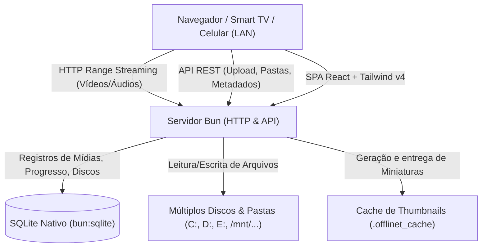

# Plano de Implementação: OffliNet - Streaming de Mídia e Explorador de Arquivos LAN

Criar um sistema de streaming de filmes e explorador de arquivos completo e de alta performance para execução em rede local (LAN), utilizando **Bun**, **SQLite nativo (`bun:sqlite`)**, **React**, **React Router**, **Tailwind CSS v4** e **Lucide Icons**.

O sistema permitirá transformar qualquer PC com discos/pastas em um servidor de mídia doméstico (estilo Netflix) com capacidade de gerenciar múltiplos discos/volumes, reproduzir vídeos fluidamente via HTTP Range Requests (seek instantâneo sem carregar o arquivo inteiro na memória), gerenciar arquivos (upload, download, renomear, excluir) e exibir miniaturas/capas.

---

## 1. Arquitetura do Sistema



### Principais Componentes:
1. **Backend (Bun)**:
   - **`bun:sqlite`**: Armazena volumes configurados (`storage_roots`), índice de arquivos/mídias (`files`), progresso de reprodução (`watch_history`), playlists/favoritos e metadados customizados.
   - **HTTP Range Streaming**: Suporte completo a `206 Partial Content` para seek rápido em vídeos `.mp4`, `.mkv`, `.webm`, `.avi`, `.mov` e áudios `.mp3`, `.flac`, `.wav`, etc.
   - **Gerenciador de Múltiplos Volumes**: Suporte a qualquer pasta de qualquer unidade (`C:\...`, `D:\...`, `E:\...` ou Linux `/media/...`).
   - **Upload & Download Streaming**: Upload com suporte a arquivos grandes sem estourar a RAM, com barra de progresso.
   - **Gerador de Miniaturas**:
     - Imagens: redimensionamento rápido em cache.
     - Vídeos: detecção de poster local (`poster.jpg`, `cover.jpg`), integração com ffmpeg (se disponível) e suporte a snapshot frame enviado pelo cliente ou capas geradas dinamicamente.
   - **Descoberta de IP LAN**: Detecção automática dos IPs locais da máquina para exibir link de acesso direto e QR Code para celulares/TVs.

2. **Frontend (React + Tailwind v4 + React Router + Lucide Icons)**:
   - **Navegação Principal**:
     - 🎬 **Modo Filme (Netflix Style)**:
       - Banner Hero com filme em destaque e botão "Assistir".
       - Fileira "Continuar Assistindo" com barra de progresso salva.
       - Carrosséis categorizados (Adicionados Recentemente, Por Pasta/Disco, Todos os Filmes).
       - Player de Vídeo Imersivo e Personalizado (Atalhos de teclado como espaço para pausar, setas para avançar 10s, tela cheia, velocidade de reprodução 0.5x a 2x, seletor de legendas `.srt`/`.vtt`, PiP).
       - Modal de detalhes com sinopse, formato, resolução estimada, data, tamanho e ações rápidas.
     - 📁 **Modo Explorador de Arquivos (Cloud Drive Style)**:
       - Barra lateral com cada volume/disco configurado e status de espaço.
       - Navegação por pastas com Breadcrumbs (`Disco D > Filmes > Ação`).
       - Visualização em Grade (Grid) ou Lista (List).
       - Filtros rápidos: Todos, Vídeos, Fotos, Músicas, Documentos.
       - Drag & Drop para upload de múltiplos arquivos.
       - Ações: Baixar, Renomear, Excluir, Criar Pasta.
       - Modal de visualização rápida de fotos, tocador de áudio integrado e leitor de texto.
     - ⚙️ **Configurações & Discos**:
       - Adicionar e remover pastas de armazenamento com validação de caminho.
       - Botão para sincronizar/indexar discos.
       - Exibição do IP da LAN (ex: `http://192.168.1.50:3000`) para conectar TVs e smartphones.

---

## 2. Estrutura Proposta de Diretórios

```
offlinet/
├── package.json
├── bunfig.toml
├── tsconfig.json
├── vite.config.ts
├── tailwind.config.js / @tailwindcss/vite
├── src/
│   ├── server/                      # Backend Bun
│   │   ├── index.ts                 # Servidor HTTP Bun com roteador
│   │   ├── db.ts                    # SQLite nativo (bun:sqlite) & migrations
│   │   ├── scanner.ts               # Varredura e indexação de pastas
│   │   ├── streamer.ts              # HTTP 206 Range streamer
│   │   ├── thumbnail.ts             # Geração/serviço de miniaturas
│   │   ├── network.ts               # Detecção de IP LAN local
│   │   └── routes/
│   │       ├── storage.ts           # Endpoints de volumes e navegação
│   │       ├── media.ts             # Endpoints do Modo Filme e histórico
│   │       ├── files.ts             # Endpoints de upload, download, delete
│   │       └── system.ts            # Info do sistema, IPs LAN, reindexação
│   └── client/                      # Frontend React SPA
│       ├── index.html
│       ├── main.tsx
│       ├── App.tsx
│       ├── index.css                # Tailwind v4 theme & custom utilities
│       ├── components/
│       │   ├── Navbar.tsx           # Alternância Modo Filme / Explorador / Configs
│       │   ├── VideoPlayer.tsx      # Player customizado com seek, legendas e resume
│       │   ├── MovieHero.tsx        # Banner Netflix style
│       │   ├── MovieRow.tsx         # Carrossel horizontal de mídias
│       │   ├── MovieDetailModal.tsx # Modal de detalhes do filme
│       │   ├── FileExplorer.tsx     # Explorador com grid/lista e breadcrumbs
│       │   ├── FileUploader.tsx     # Upload drag & drop com progresso
│       │   ├── MediaPreviewModal.tsx# Preview de fotos, áudios e docs
│       │   └── StorageSettings.tsx  # Gerenciamento de discos e info de LAN
│       ├── hooks/
│       │   └── useMediaPlayback.ts  # Hook para salvar/recuperar progresso
│       └── types/
│           └── index.ts             # Interfaces TypeScript compartilhadas
```

---

## 3. Detalhes de Implementação

### 3.1. SQLite Nativo (`bun:sqlite`)
Tabelas:
- `storage_roots`: `id`, `name`, `path`, `is_active`, `created_at`
- `files`: `id`, `storage_id`, `relative_path`, `full_path`, `filename`, `extension`, `size`, `is_directory`, `media_type` ('video', 'image', 'audio', 'document', 'other'), `mime_type`, `duration`, `thumbnail_path`, `updated_at`
- `watch_history`: `id`, `file_id`, `progress_seconds`, `duration_seconds`, `completed`, `last_watched_at`
- `media_metadata`: `file_id`, `title`, `year`, `genre`, `custom_cover`

### 3.2. Streaming de Mídia de Alta Performance
- Leitura em chunks com `Bun.file(filePath).slice(start, end)`.
- Resposta `206 Partial Content` com cabeçalhos:
  - `Content-Range: bytes ${start}-${end}/${totalSize}`
  - `Accept-Ranges: bytes`
  - `Content-Length: ${chunkSize}`
  - `Content-Type: ${mimeType}`
- Permite que qualquer player (HTML5 no PC, iPhone, Android, Smart TV Tizen/WebOS via navegador) salte instantaneamente para qualquer minuto do filme.

### 3.3. Modo Explorador
- Navegação fluida com suporte a qualquer unidade física (ex: `C:`, `D:`, `E:`).
- Upload com `FormData` em stream diretamente para o disco selecionado.
- Exclusão com confirmação segura e renomeação de arquivos.

### 3.4. Modo Cinema / Filme
- Interface inspirada em serviços de streaming modernos, com tema escuro imersivo.
- Destaque dinâmico e fileiras de continuar assistindo.
- Player com controles na tela, atalhos de teclado (Espaço = pause, F = tela cheia, M = mudo, ←/→ = 10s).

---

## 4. Plano de Verificação

### Testes Automatizados e de Integração:
1. **Inicialização do Banco**: Testar criação automática de tabelas no SQLite.
2. **Scanner de Pastas**: Testar indexação de pastas locais e detecção de formatos de vídeo (`.mp4`, `.mkv`, etc.) e fotos.
3. **Endpoint de Streaming**: Testar requisições HTTP com cabeçalho `Range: bytes=0-1024` e verificar retorno de status `206` e headers corretos.
4. **Build do Frontend**: Testar compilação do Vite + Tailwind v4 + React Router sem erros de tipo.

### Testes Manuais no Navegador:
1. Acessar `http://localhost:3000` (ou IP da LAN).
2. Adicionar uma pasta de teste com vídeos/fotos na tela de Configurações.
3. No **Modo Filme**, reproduzir um vídeo, pausar no meio, atualizar a página e verificar se o "Continuar Assistindo" retoma exatamente do ponto.
4. No **Modo Explorador**, navegar pelas pastas, fazer upload de um arquivo novo, abrir o preview de imagem e baixar o arquivo.
